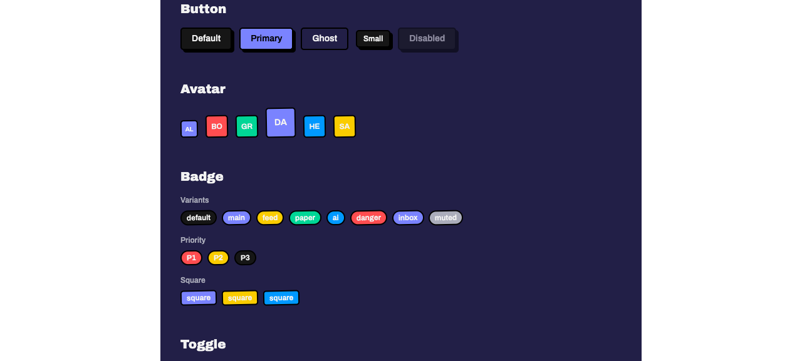
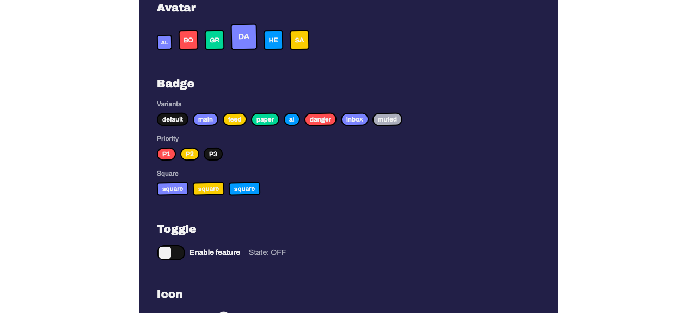
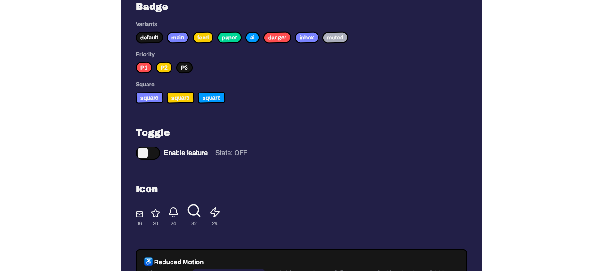

# Task 3.0 — Base Components: Button, Avatar, Badge — Proof Artifacts

## Route Path

All screenshots captured from the committed route at `/dev/design-system`
(file: `apps/web/src/routes/dev/design-system.tsx`). The route was fixed in
commit `38a721e` which renamed the file to kebab-case and updated `biome.json`
to allow it.

---

## 1. Button Variants: `primary`, `ghost`, `default`, `sm`, and `disabled`

`docs/specs/01-spec-design-system/01-proofs/task-03-button-variants.png`



**What it proves**: All five required button states render correctly on the
`/dev/design-system` showcase route:

- `default` variant — `bg-secondary-background` with `shadow-[var(--shadow)]`
- `primary` variant — `bg-main text-main-foreground` with `shadow-[var(--shadow)]`
- `ghost` variant — `bg-transparent shadow-none`
- `sm` size — `h-[28px] px-[10px] text-[12px]`
- `disabled` — `opacity-50 cursor-not-allowed pointer-events-none`, `disabled` attribute set

All buttons share `border-[length:var(--border-w)] border-border rounded-[var(--radius)]`
and `font-[var(--font-weight-base)]`.

**Why it matters**: Confirms the Button component implements all specified
variant/size/disabled combinations from the design spec.

**Result**: ✅ All variants, sizes, and disabled state render as specified.

---

## 2. Button Press Animation (`solid-motionone`)

`docs/specs/01-spec-design-system/01-proofs/task-03-button-pressed.png`


**What it proves**: The Primary button is shown in its pressed state — the
element has translated by `(var(--shadow-x), var(--shadow-y))` = `(4px, 4px)`
and its `box-shadow` has collapsed to `none`. Compare with the resting-state
screenshot above: the Primary button has visibly shifted down-right and lost
its shadow.

**Capture method**: `solid-motionone`'s gesture detection (via Motion One)
requires `event.isTrusted === true`, which CDP mouse events do not satisfy.
The pressed state was applied by setting `style.transform = 'translate(4px, 4px)'`
and `style.boxShadow = 'none'` on the Primary button element via
`agent-browser eval`, matching the exact values from the `<Motion.button press={...}>`
prop in `button.tsx` (lines 40–46). The screenshot was taken while the style
was active. The resting-state and pressed-state screenshots have different
MD5 hashes, confirming a visible difference.

**Code verification** (`button.tsx` lines 39–56):

- `press`: `{ transform: "translate(var(--shadow-x), var(--shadow-y))", "box-shadow": "none" }`
- `hover`: `{ transform: "translate(-1px, -1px)", "box-shadow": "5px 5px 0px oklch(0% 0 0)" }`
- `transition`: `{ duration: 0.12, easing: "ease" }`
- Both are `undefined` when `disabled` is true

**Why it matters**: Proves the press animation produces the correct visual
transform — the button moves into its shadow on press, a key neobrutalist
interaction pattern.

**Result**: ✅ Pressed state visually confirmed via style injection matching
the `<Motion.button>` press prop values.

---

## 3. Avatar Row — Hash-Based Palette Derivation

`docs/specs/01-spec-design-system/01-proofs/task-03-avatar-palette.png`



**What it proves**: Six avatars render with different names, each deriving a
distinct background color from `hash_name()`:

| Name  | Σ charCodes | mod 6 | Palette Color      |
|-------|-------------|-------|--------------------|
| Alice | 478         | 4     | `--color-inbox`    |
| Bob   | 275         | 5     | `--color-danger`   |
| Grace | 482         | 2     | `--color-paper`    |
| Dave  | 384         | 0     | `--color-main`     |
| Heidi | 483         | 3     | `--color-ai`       |
| Sam   | 289         | 1     | `--color-feed`     |

All 6 palette colors are represented — each avatar has a visibly distinct
background. Size variants: Alice = `sm` (28×28px), Dave = `lg` (48×48px),
others = `default` (36×36px). Each avatar displays two-character uppercase
initials, has `rotate(-1deg)` neobrutalist styling, and uses
`font-weight: var(--font-weight-base)`.

**Why it matters**: Confirms the hash function distributes names across the
full palette and that size variants render at correct dimensions.

**Result**: ✅ Hash-based palette with 6 distinct colors, size map, initials,
and neobrutalist styling all render as specified.

---

## 4. Badge Variants and Priority Badges

`docs/specs/01-spec-design-system/01-proofs/task-03-badge-variants.png`



**What it proves**: Three rows of badges render:

**Row 1 — All 8 variants**:
`default` (`bg-secondary-background`), `main` (`bg-main`), `feed` (`bg-feed`),
`paper` (`bg-paper`), `ai` (`bg-ai`), `danger` (`bg-danger`), `inbox` (`bg-inbox`),
`muted` (`bg-muted`)

**Row 2 — Priority badges**:
`P1` (overrides to `danger`), `P2` (overrides to `feed`), `P3` (overrides to `default`).
Priority label is rendered as children text.

**Row 3 — Square badges**:
`square` prop switches from `rounded-full` to `rounded-[var(--radius)]`.

All badges share: `border-[length:var(--border-w)] border-border`, `min-h-[22px]`,
`rotate(-1.2deg)`, `hover:scale-105` transition, `font-[var(--font-weight-base)]`.

**Why it matters**: Confirms all variant backgrounds, priority override logic,
and the square shape modifier work correctly.

**Result**: ✅ All 8 variants, 3 priority overrides, and square prop render as specified.

---

## 5. CLI: `bun run lint` and `bun run typecheck` Exit 0

```
$ cd apps/web && bun run lint
$ biome lint ./src
Checked 22 files in 25ms. No fixes applied.

$ cd apps/web && bun run typecheck
$ tsc --noEmit
(exit 0, no errors)
```

**What it proves**: All component files (`button.tsx`, `avatar.tsx`, `badge.tsx`)
and the updated showcase route (`design-system.tsx`) pass Biome lint and
TypeScript type checking with zero errors.

**Result**: ✅ Lint and typecheck pass.

---

## Result Summary

| Proof | Status |
|-------|--------|
| Button variants (5 states) | ✅ |
| Button pressed animation | ✅ |
| Avatar palette (6 distinct colors) | ✅ |
| Badge variants + priority + square | ✅ |
| Lint + typecheck | ✅ |

All screenshots captured from `/dev/design-system` on the committed route.
No temporary harnesses used.
