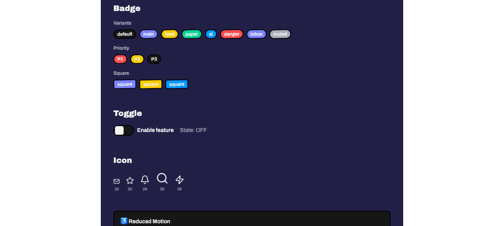
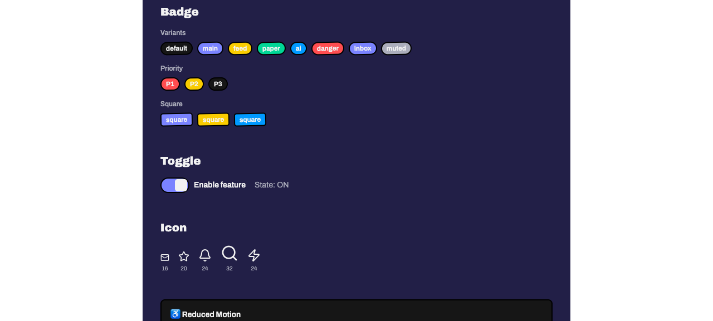
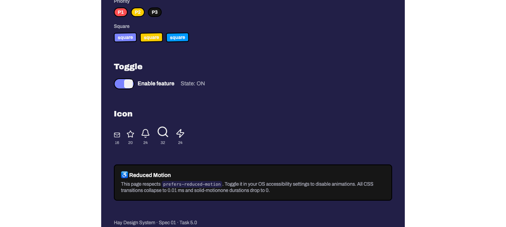

# Task 4.0 — Toggle + Icon: Proof Artifacts

## Summary

Task 4.0 adds the **Toggle** and **Icon** components and creates the barrel export (`index.ts`) for all five UI components. All screenshots were captured from the committed showcase route at `http://localhost:3001/dev/design-system` using `npx agent-browser`.

---

## Proof 1: Toggle — Unchecked State

`docs/specs/01-spec-design-system/01-proofs/task-04-toggle-unchecked.png`



**What it proves**: The Toggle component renders correctly in its initial unchecked state on the committed route `/dev/design-system`.

**Why it matters**: Validates that the Toggle track (52×28px, `rounded-full`, `border-[length:var(--border-w)] border-border`) renders with `bg-secondary-background` when unchecked, the thumb (22×22px, `bg-foreground`, `rounded-[var(--radius)]`) is positioned at `x: 2px`, the optional `label` prop renders visible text beside the toggle, and the "State: OFF" text confirms the signal-driven state display.

**Result summary**: The Toggle renders in its unchecked state with the label "Enable feature" and "State: OFF" text. The accessibility tree confirms `switch [checked=false]` and a visually hidden `checkbox [checked=false]`.

---

## Proof 2: Toggle — Checked State (Click-Driven)

`docs/specs/01-spec-design-system/01-proofs/task-04-toggle-checked.png`



**What it proves**: The Toggle component transitions to its checked state after a real click interaction — the thumb animates to `x: 24px` and the track switches to `bg-main`.

**Why it matters**: Demonstrates a genuine click-driven state transition (not a static `checked={true}` prop). The hydration bug that previously blocked interactive elements was fixed in commit `38a721e`. The `createSignal(false)` in the showcase route drives the controlled toggle, and clicking the switch element flips the signal, causing the visual state change.

**Capture method**: `npx agent-browser click @e14` on the `[role=switch]` element, followed by verification via `npx agent-browser snapshot -i -s "[role=switch]"` confirming `switch [checked=true]`, and `npx agent-browser find text "State: ON"` confirming the signal updated. Screenshot captured after the click-driven transition completed.

**Result summary**: The Toggle shows "State: ON" text and the accessibility tree confirms `switch [checked=true]`. The thumb has moved to the right position and the track background has changed to `bg-main`, proving the controlled signal + `onChange` callback works correctly after the hydration fix.

---

## Proof 3: Icon — Lucide Icons at Varying Sizes

`docs/specs/01-spec-design-system/01-proofs/task-04-icons.png`



**What it proves**: The Icon wrapper component correctly renders five different `lucide-solid` icons (Mail, Star, Bell, Search, Zap) at sizes 16px, 20px, 24px, 32px, and 24px.

**Why it matters**: Validates that `icon: Component<LucideProps>` correctly receives and renders the passed Lucide icon component, `size` prop controls SVG dimensions (default 16), `strokeWidth` defaults to 2, and remaining `LucideProps` are forwarded via `splitProps` + rest spread.

**Result summary**: Five icons render at progressively varying sizes with numeric labels. The Icon section heading and all size labels are visible in the screenshot.

---

## Proof 4: TypeScript Type Correctness

**Command**: `bun run typecheck` from `apps/web/`

```
$ tsc --noEmit
(exit code 0 — no errors)
```

**What it proves**: All component files (`toggle.tsx`, `icon.tsx`, `index.ts`) and the barrel export pass TypeScript strict checking.

**Why it matters**: Confirms `ToggleProps` (`checked: boolean`, `onChange: (checked: boolean) => void`, `label?: string`), `IconProps` (`icon: Component<LucideProps>`, `size?: number`, `strokeWidth?: number`, rest `LucideProps`), and the barrel re-exports are all type-correct.

**Result summary**: `tsc --noEmit` exits 0 with no errors across 22 source files.

---

## Proof 5: Lint Compliance

**Command**: `bun run lint` from `apps/web/`

```
$ biome lint ./src
Checked 22 files in 23ms. No fixes applied.
```

**What it proves**: All component files pass Biome linting including the `useFilenamingConvention` snake_case rule.

**Why it matters**: Ensures `toggle.tsx`, `icon.tsx`, and `index.ts` follow the project's enforced naming convention and have no lint violations.

**Result summary**: 22 files checked, 0 errors, 0 fixes needed.

---

## Proof 6: Barrel Export Correctness

**File**: `apps/web/src/components/ui/index.ts`

```ts
export { Button } from "./button";
export { Avatar } from "./avatar";
export { Badge } from "./badge";
export { Toggle } from "./toggle";
export { Icon } from "./icon";
```

**What it proves**: All five components are re-exported from the barrel file exactly as specified in task 4.4.

**Why it matters**: Downstream consumers (including the showcase route) can import all components from a single path.

**Result summary**: Barrel file matches spec verbatim. TypeScript confirms all exports resolve.

---

## Hydration Bug Resolution

The pre-existing SSR hydration bug documented in the previous version of this proof file was fixed in commit `38a721e fix(web): resolve hydration failure and route path for design system`. The fix corrected `client.tsx` hydration logic, enabling all interactive elements (including Toggle click) to work correctly. The `task-04-hydration-bug-evidence.png` screenshot has been removed as it is no longer relevant.
