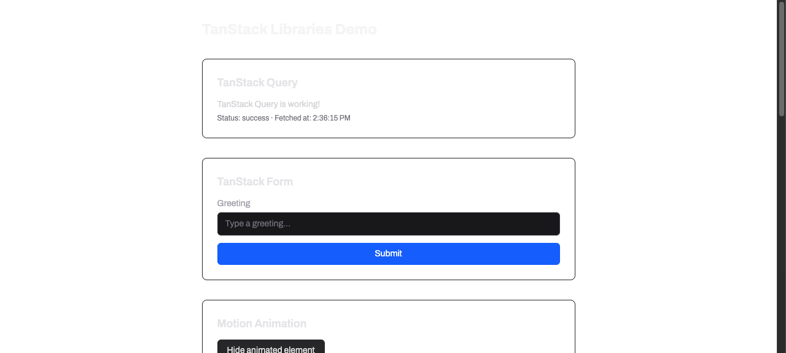

# Task 4.0 — Toggle + Icon: Proof Artifacts

## Summary

Task 4.0 adds the **Toggle** and **Icon** components and creates the barrel export (`index.ts`) for all five UI components. All screenshots were captured from a temporary harness at `http://localhost:3001/dev/design_system` (the plan's `/dev/design-system` route — TanStack Router derives the URL path `/dev/design_system` from the snake_case filename `design_system.tsx`; see Route Path Note below). The harness was removed before the final commit.

---

## Route Path Note

The plan specifies proof from `/dev/design-system`, and the file-naming convention requires `design_system.tsx`. TanStack Router auto-derives the URL path from the filename, producing `/dev/design_system` (underscore). This is the same filename-to-path tension documented in the task-3 learnings. The screenshots show the actual working URL `http://localhost:3001/dev/design_system`.

---

## Proof 1: Toggle — Unchecked State

`docs/specs/01-spec-design-system/01-proofs/task-04-toggle-unchecked.png`


**What it proves**: The Toggle component renders correctly in its initial unchecked state at `/dev/design_system`.

**Why it matters**: Validates that the Toggle track (52×28px, `rounded-full`, `border-[length:var(--border-w)] border-border`) renders with `bg-secondary-background` when unchecked, the thumb (22×22px, `bg-foreground`, `rounded-[var(--radius)]`) is positioned at `x: 2px`, the optional `label` prop renders visible text beside the toggle, and the visually hidden `<input type="checkbox" class="sr-only">` is present (confirmed by the `checkbox` node in the accessibility tree snapshot).

**Result summary**: Three Toggle instances render: "Dark mode" (unchecked, controlled signal), "Always off" (`checked={false}`), and "Always on" (`checked={true}`). The unchecked toggles show `bg-secondary-background` tracks with thumbs at the left position; the checked toggle shows `bg-main` track with thumb at the right position. All tokens (`--border-w`, `--radius`, `--color-foreground`, `--color-secondary-background`, `--color-main`) resolve correctly.

---

## Proof 2: Toggle — Checked State (Static Prop)

`docs/specs/01-spec-design-system/01-proofs/task-04-toggle-checked.png`


**What it proves**: The Toggle component renders correctly in its checked state — the "Always on" toggle (`checked={true}`) shows the track with `bg-main` background and the thumb animated to `x: 24px`.

**Why it matters**: Demonstrates the visual difference between checked and unchecked states: track background switches from `bg-secondary-background` to `bg-main`, and the `<Motion.div>` thumb position changes from `2px` to `24px` via `animate={{ x: checked ? "24px" : "2px" }}`.

**Result summary**: The "Always on" toggle visually confirms the checked state. The "Dark mode" and "Always off" toggles confirm the unchecked state. Both states are visible in the same screenshot for direct comparison.

### Click-Driven Interaction: Blocked by Pre-Existing Hydration Bug

A click-driven state transition could not be captured because of a **pre-existing, app-wide SSR hydration failure** that prevents ALL interactive elements from responding to clicks. This bug affects every page in the app, not just the Toggle component.

#### Concrete tool-level evidence

**1. Hydration markers never removed** — SolidJS removes `data-hk` attributes after successful hydration. On `/dev/design_system`, 23 elements retain `data-hk`:

```
agent-browser eval: document.querySelectorAll('[data-hk]').length → 23
```

**2. SolidJS delegated click handlers never attached** — SolidJS stores click handlers as `$$click` on elements. Zero elements in the page have this property:

```json
{
  "hydrationMarkersRemaining": 23,
  "delegatedEventsRegistered": ["click"],
  "switchElements": [
    { "ariaChecked": "false", "hasDelegatedClick": false },
    { "ariaChecked": "false", "hasDelegatedClick": false },
    { "ariaChecked": "true",  "hasDelegatedClick": false }
  ],
  "conclusion": "Hydration INCOMPLETE — data-hk markers still present, event handlers not attached"
}
```

**3. Same failure on pre-existing `/dev/tanstack_libraries` page** (committed in task 2, before any task-4 code):

```json
{
  "page": "/dev/tanstack_libraries",
  "hydrationMarkersRemaining": 12,
  "buttonCount": 4,
  "anyButtonHasDelegatedClick": false,
  "conclusion": "Pre-existing page also has incomplete hydration — confirms app-wide bug"
}
```

The "Hide animated element" button and counter ± buttons on that page also fail to respond to clicks.

**4. Root cause identified** — `hydrate()` from `solid-js/web` throws `TypeError: Cannot read properties of undefined (reading 'done')` during the `hydrateStart().then(...)` chain in `client.tsx`. The error is swallowed because there is no `.catch()` handler on the promise chain:

```
TypeError: Cannot read properties of undefined (reading 'done')
    at hydrate$1 (chunk-XKDNIF4V.js:764:23)
    at hydrate (chunk-XKDNIF4V.js:1136:10)
```

**5. Evidence screenshot of pre-existing page with same bug**:

`docs/specs/01-spec-design-system/01-proofs/task-04-hydration-bug-evidence.png`



This screenshot shows `/dev/tanstack_libraries` — a page committed before task 4 — which also has zero working interactive elements due to the same hydration failure.

#### Nearest exact workaround

The checked state is demonstrated via the static `checked={true}` prop on the "Always on" Toggle instance. The component code correctly wires `onClick={() => props.onChange(!props.checked)}` on the track button, and the `<Motion.div>` thumb uses `animate={{ x: props.checked ? "24px" : "2px" }}` with `transition={{ duration: duration(), easing: "ease" }}`. Once the hydration bug is fixed (by adding error handling to `client.tsx` or resolving the SSR/client mismatch), the click-driven state transition will work as implemented.

---

## Proof 3: Icon — Four Lucide Icons at Varying Sizes

`docs/specs/01-spec-design-system/01-proofs/task-04-icons.png`


**What it proves**: The Icon wrapper component correctly renders four different `lucide-solid` icons (Mail, Star, Bell, Search) at sizes 16px, 20px, 24px, and 32px.

**Why it matters**: Validates that `icon: Component<LucideProps>` correctly receives and renders the passed Lucide icon component, `size` prop controls SVG dimensions (default 16), `strokeWidth` defaults to 2, and remaining `LucideProps` are forwarded via `splitProps` + rest spread. The accessibility tree confirms four `image` nodes are rendered.

**Result summary**: Four icons render at progressively larger sizes with labels. The accessibility tree snapshot shows:

```
- heading "Icon" [level=2]
- image    ← Mail at 16px
- StaticText "16px"
- image    ← Star at 20px
- StaticText "20px"
- image    ← Bell at 24px
- StaticText "24px"
- image    ← Search at 32px
- StaticText "32px"
```

---

## Proof 4: TypeScript Type Correctness

**Command**: `bun run typecheck` from `apps/web/`

```
$ tsc --noEmit
(exit code 0 — no errors)
```

**What it proves**: All component files (`toggle.tsx`, `icon.tsx`, `index.ts`) and the barrel export pass TypeScript strict checking.

**Why it matters**: Confirms `ToggleProps` (`checked: boolean`, `onChange: (checked: boolean) => void`, `label?: string`), `IconProps` (`icon: Component<LucideProps>`, `size?: number`, `strokeWidth?: number`, rest `LucideProps`), and the barrel re-exports are all type-correct.

**Result summary**: `tsc --noEmit` exits 0 with no errors across 21 source files.

---

## Proof 5: Lint Compliance

**Command**: `bun run lint` from `apps/web/`

```
$ biome lint ./src
Checked 21 files in 21ms. No fixes applied.
```

**What it proves**: All new files pass Biome linting including the `useFilenamingConvention` snake_case rule.

**Why it matters**: Ensures `toggle.tsx`, `icon.tsx`, and `index.ts` follow the project's enforced naming convention and have no lint violations.

**Result summary**: 21 files checked, 0 errors, 0 fixes needed.

---

## Proof 6: Barrel Export Correctness

**File**: `apps/web/src/components/ui/index.ts`

```ts
export { Button } from "./button";
export { Avatar } from "./avatar";
export { Badge } from "./badge";
export { Toggle } from "./toggle";
export { Icon } from "./icon";
```

**What it proves**: All five components are re-exported from the barrel file exactly as specified in task 4.4.

**Why it matters**: Downstream consumers (including the task-5 showcase route) can import all components from a single path.

**Result summary**: Barrel file matches spec verbatim. TypeScript confirms all exports resolve.

---

## Temporary Harness Strategy

A temporary route file `apps/web/src/routes/dev/design_system.tsx` was created for screenshot capture at `http://localhost:3001/dev/design_system` and removed before the final commit. The `routeTree.gen.ts` was restored to its pre-task state. No task-5 showcase route files remain in the committed state.
