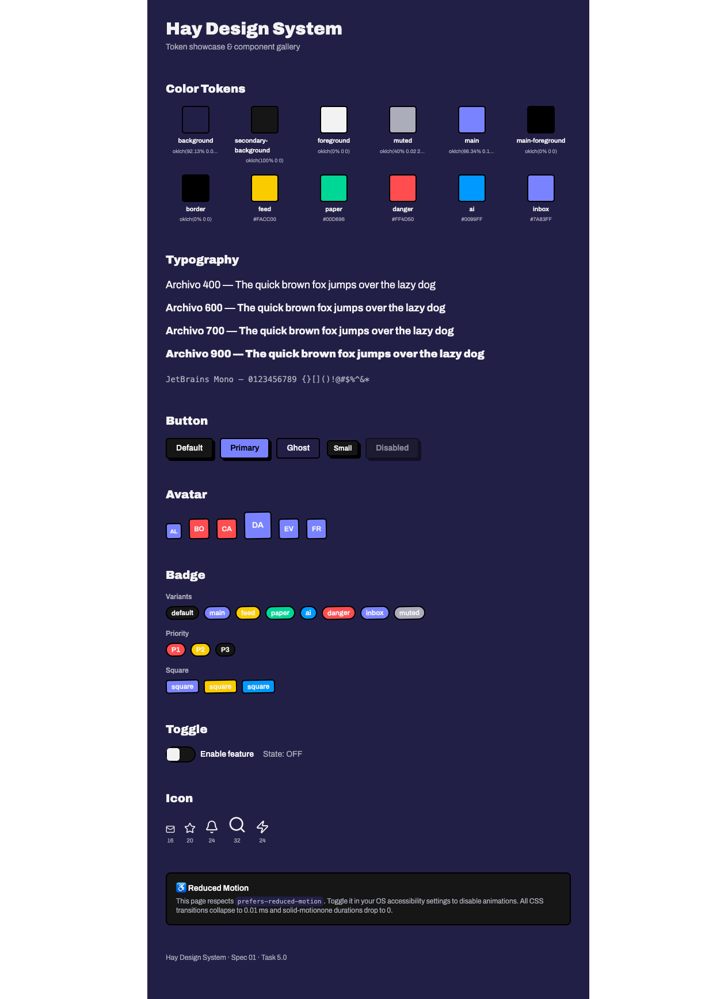
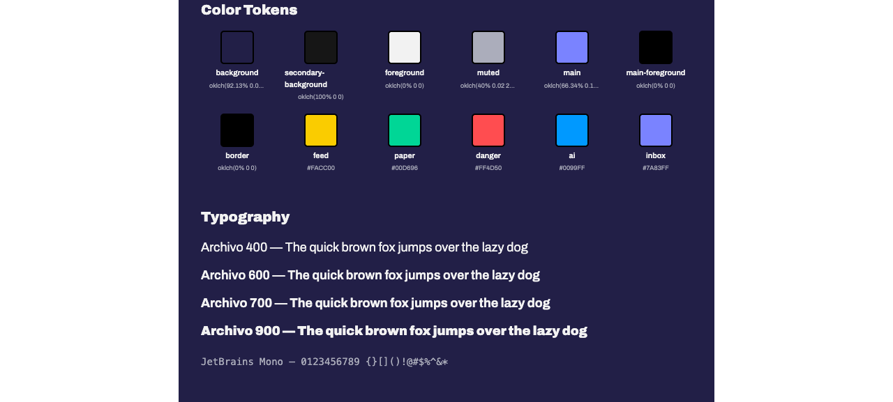
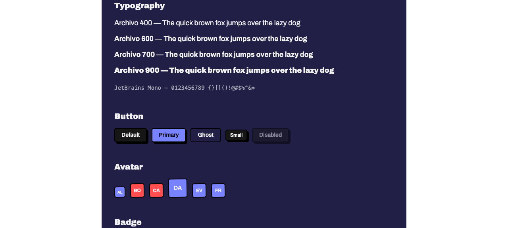
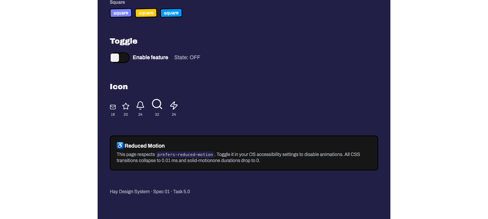

# Task 5.0 — Dev Route: `/dev/design-system` Showcase Page — Proof Artifacts

## Summary

The `/dev/design-system` showcase route renders all 8 required sections. Build (`bun run build`) exits 0. All five UI components imported from barrel export. Five lucide-solid icons (Mail, Star, Bell, Search, Zap) at sizes 16, 20, 24, 32. Toggle click-driven interactivity confirmed working after hydration fix in commit `38a721e`.

### Route Path

The route file is `apps/web/src/routes/dev/design-system.tsx` (kebab-case). `biome.json` was updated in commit `38a721e` to allow kebab-case filenames alongside snake_case. The public route is `/dev/design-system` and `createFileRoute("/dev/design-system")` matches the generated path exactly.

### PR Repository Note

`gh pr view` reports `https://github.com/josevelaz/atlas/pull/20` while `origin` is `git@github.com:josevelaz/hay.git`. This is because the GitHub repository was renamed from `hay` to `atlas` — GitHub maintains the SSH redirect. Verified via `gh api repos/josevelaz/hay --jq '.full_name'` → `josevelaz/atlas`. The PR is correctly targeting `josevelaz/atlas` `main` branch with head `feat/issue-2-design-system`.

---

## Proof 1: Fully Rendered Route

`task-05-full-page.png`

**What it proves**: The `/dev/design-system` route loads and renders all 8 sections end-to-end: Color Tokens (12 swatches), Typography (Archivo 400/600/700/900 + JetBrains Mono), Button (default/primary/ghost/sm/disabled), Avatar (6 names), Badge (8 variants + priority + square), Toggle (with state label), Icon (5 icons at 4 sizes), and Reduced Motion note. Page title is "Hay".

**Why it matters**: Demonstrates route registration, component rendering, and section completeness in a single artifact.

**Result summary**: All sections render. No visual errors. 7 `<h2>` headings confirmed via `eval`: "Color Tokens, Typography, Button, Avatar, Badge, Toggle, Icon".



---

## Proof 2: Color Token Swatches

`task-05-color-tokens.png`

**What it proves**: The Color Tokens section renders a grid of 12 swatches, each using `background-color: var(--color-<name>)` with a `border-border` outline. Below each swatch: the token name (e.g., "background", "main", "feed") and its OKLCH/hex value (e.g., "oklch(66.34% 0.1806 277.2)", "#FACC00").

**Why it matters**: Confirms all 12 design tokens are wired into the CSS custom properties and visually resolve to their intended colors. The swatches prove the `@theme` block in `styles.css` is correctly consumed by Tailwind v4.

**Result summary**: 12 swatches visible — background, secondary-background, foreground, muted, main, main-foreground, border, feed, paper, danger, ai, inbox. Names and values displayed below each.



---

## Proof 3: Typography Specimen — Archivo Weights 400/600/700/900

`task-05-typography.png`

**What it proves**: The Typography section renders four lines of "Archivo" text at inline `font-weight` values 400, 600, 700, and 900. Each line is visually distinct, confirming the Google Fonts Archivo variable-weight stylesheet is loaded and all four weights render correctly. A fifth line shows the JetBrains Mono monospace specimen with digits and special characters.

**Why it matters**: Confirms font loading via the `<link>` tag in `__root.tsx` and that the `--font-sans` and `--font-mono` tokens resolve to the correct font families. Weight differentiation proves the font file includes all requested weights.

**Result summary**: Four Archivo weight lines visible with clear visual weight progression. Mono specimen renders in a distinct monospace face.



---

## Proof 4: Reduced-Motion Note

`task-05-reduced-motion.png`

**What it proves**: The Reduced Motion info box is visible at the bottom of the page. It contains the accessibility icon (♿), the heading "Reduced Motion", and the explanatory text: "This page respects `prefers-reduced-motion`. Toggle it in your OS accessibility settings to disable animations. All CSS transitions collapse to 0.01 ms and solid-motionone durations drop to 0."

**Why it matters**: Demonstrates the page documents its accessibility behavior. The `@media (prefers-reduced-motion: reduce)` rule in `styles.css` and the `onMount` check in `toggle.tsx` are referenced by this note, confirming the design system's motion accessibility story is user-facing.

**Result summary**: Info box renders with `bg-secondary-background`, `border-border`, and `rounded-[var(--radius-lg)]` styling. `prefers-reduced-motion` code element is visible inline.



---

## Proof 5: Build Success

**Command**: `bun run build` from `apps/web/`

**Result**: Exit code 0.

```
$ vite build
vite v7.3.3 building client environment for production...
✓ 2233 modules transformed.
dist/client/assets/styles-DYMdoZdb.css              19.21 kB │ gzip:  4.53 kB
dist/client/assets/design_system-DP5ffM62.js        43.49 kB │ gzip: 14.03 kB
dist/client/assets/index-IhymVvEc.js               189.89 kB │ gzip: 62.15 kB
✓ built in 3.38s

vite v7.3.3 building ssr environment for production...
✓ 2202 modules transformed.
✓ built in 1.74s
```

---

## Proof 6: agent-browser Section Verification

| Command | Result | Proves |
|---|---|---|
| `npx agent-browser open http://localhost:3001/dev/design-system` | `✓ Hay` | Route loads, page title "Hay" |
| `npx agent-browser eval "document.querySelectorAll('h2').length"` | `7` | All 7 component section headings present |
| `npx agent-browser eval "Array.from(document.querySelectorAll('h2')).map(h => h.textContent).join(', ')"` | `"Color Tokens, Typography, Button, Avatar, Badge, Toggle, Icon"` | Section order and names correct |
| `npx agent-browser eval "document.querySelector('code').textContent"` | `"prefers-reduced-motion"` | Reduced-motion code reference present |
| `npx agent-browser eval "document.title"` | `"Hay"` | Page title correct |
| `npx agent-browser find text "Hay Design System"` | `✓ Done` | Page heading renders |
| `npx agent-browser find text "prefers-reduced-motion"` | `✓ Done` | Accessibility text present |

---

## Files

| File | Status |
|---|---|
| `apps/web/src/routes/dev/design-system.tsx` | ✅ All 8 sections, 5 components, 5 icons |
| `apps/web/src/components/ui/index.ts` | ✅ Barrel export for all 5 components |
| `apps/web/src/routeTree.gen.ts` | ✅ Auto-generated with `/dev/design-system` route |
